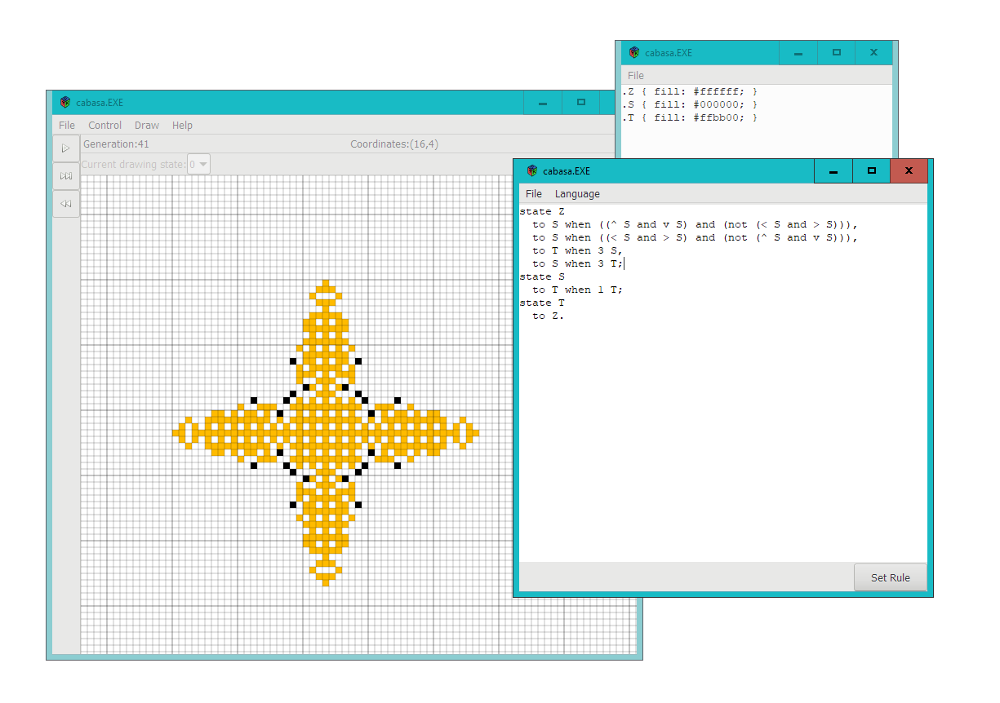

# Cabasa

Cabasa is an application for the simulation of arbitrary 2D cellular automata (henceforth CA/CAs for clarity).
In contrast to other CA simulation applications which only allow a limited set of CAs to be simulated,
  Cabasa allows allows the simulation of any 2D CA on a rectangular grid.

## Features

- Allows the use of two flexible languages to specify CAs:
  the [ALPACA](https://github.com/catseye/ALPACA/blob/0b2d57b8739dc240969c62c8e1cd13c1863770e0) language (originally by @cpressey)
  as well as the Haskell programming language.
- An interactive user interface based on the widely-used [Golly](http://golly.sourceforge.net/) CA simulator
  allowing patterns to be drawn easily.
- Able to open and save patterns in the [MCell](http://psoup.math.wisc.edu/mcell/ca_files_formats.html#MCell) file format.

## Installation

As of this moment, there are no pre-built binaries to download; you will have to compile Cabasa from source.
For more details on how to do this, see [`BUILDING.md`](BUILDING.md).

## FAQs

### Q: Are there any downloads?

A: Not yet.
This is because Cabasa relies on the Haskell programming language to work;
  if a Haskell package repository is not available, some parts of Cabasa will not work properly.
Unfortunately, it is fairly hard to package a repository of this sort with Cabasa.
The program is still usable even if this repository is not available,
  but I would like to fix this problem before I create any downloads.

Note that this problem does not affect copies of Cabasa which are run with `stack exec`.

### Q: How is this different to Golly/MCell/my favourite CA program?

A: Existing CA programs can only simulate certain built-in types of cellular automata.
However, Cabasa aims to support almost any 2D CA.

The upshot of this is:
  If your desired CA can be simulated with another software, use it! It's likely to be faster and easier to use than Cabasa.
However, if you want to try out a completely novel CA, then you should seriously think about using Cabasa.

### Q: This is still a very new project. Are you *sure* people have been frequently asking these questions?

Good observation.
But, if I were to see this sort of project, the above would be the questions I would want to ask.

If you have another question, feel free to ask me and I'll add it to this list!
