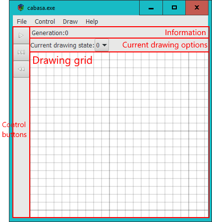

= Cabasa: User Manual
:toc:
:experimental:
:source-highlighter: rouge

== About Cabasa

=== Overview of Cabasa

Cabasa is an application for the simulation of https://conwaylife.com/wiki/Cellular_automaton[cellular automata].
It is currently able to simulate **arbitrary 2D cellular automata** on a **finite rectangular grid**.

Cabasa is distributed as a https://www.haskell.org/[Haskell] library.
To use Cabasa with a cellular automaton, implement the automaton as a Haskell program,
  then use the `launchCabasa` function to start Cabasa within this program.
Launch Cabasa by then compiling and running this program.

[[chap:qstart]]
=== Quickstart

The following Haskell program uses Cabasa to simulate
  https://conwaylife.com/wiki/Conway%27s_Game_of_Life[Conway's Game of Life]:

[source,haskell,linenums]
----
main = launchCabasa NoPersist $
    RuleConfig
        _rule
        (100,100)
        (const False)
        (\x -> if x then (0,0,0) else (1,1,1))
        [False,True]
        (\x -> if x then 1 else 0)
        (==1)
  where
    _rule :: Applicative t => CARuleA t Point Bool
    _rule = pureRule $ \p g ->
        let surrounds = count id $ let r = fmap (`peek` g) $ moore False p in r
        in
            case peek p g of
                False -> surrounds == 3
                True  -> surrounds `elem` [2, 3]
----

To launch Cabasa, compile this program with `cabasa` and `cellular-automata` as dependencies,
  and then run the resulting executable.
Cabasa will then start an interactive window which allows experimentation with this cellular automaton.

To start, let's specify an initial condition, by drawing a pattern.
Select state `1` from the dropdown box at the top of the window marked '`Current drawing state`'
  (see screenshot, Figure [TODO]).
You should then be able to draw patterns on the grid.
If you press the kbd:[M] key, you can click and drag to move around;
  pressing kbd[D] gets you back to drawing mode.

To actually run the cellular automaton, press the triangular btn:[Play] button on the left of the screen.
Pressing it again should pause the evolution.
You should observe the pattern changing as Cabasa modifies the displayed pattern according to the specified rules.

[[sec:ui]]
== User interface

The main window, is composed of several parts.
The large grid in the middle shows the current state of the CA grid. The
user can draw on the grid, move around to show the rest of the grid, and
use the currently loaded CA to evolve the pattern shown on the grid.

The information pane, just below the menu, shows various pieces of information about the current application state.
These include the current generation as well as the current cursor position.

The drawing options pane, below the information pane, shows options
related to drawing, such as the current state. but future versions may add more.
This pane will be disabled whenever drawing mode is disabled.

[[sec:drming]]
=== Drawing and Moving

The application starts in _drawing mode_. In this mode, clicking and
dragging on the grid changes the state of each cell the cursor passes
over.

By default, the grid starts with all grid cells set to a user-configurable default state, and the
current _drawing state_ set to 0. By changing the selected state (next to the text
'`Current drawing state`'), other states can be chosen.
Clicking and dragging will change the cells under the cursor to the chosen state.
For instance, if state 1 is selected, then clicking and dragging on the grid will change
the cells under the cursor to state 1. Note that the states are numbered
starting from 0, not 1, so to select e.g. the second state you have
declared, you need to select state 1, not state 2.

Moving around the grid requires another mode, called _move mode_. This mode can
be selected from the menu:Draw[Mode] menu, or by pressing the kbd:[M] key. You can get back to
drawing mode by using the menu:Draw menu, or by pressing the kbd:[D] key. In this mode,
clicking and dragging will not draw on the grid, but rather will move or
pan around the grid. Enabling this mode will also disable the '`drawing
options`' pane.

In any mode, you can also zoom in and out using the mouse wheel. Scroll
up over a point to zoom in to that point, and scroll down to zoom out.

If you zoom out far enough, you will notice that the grid abruptly comes
to an end at a certain point. This is because the grid is finite.
However, the grid `wraps around' at its edges; that is, if you move off
one edge of the grid, you reappear at the opposite edge. For instance,
the cell immediately above the topmost cell is considered to be the
bottommost cell.

[[sec:gridsize]]
=== Changing the Grid Size

By default, Cabasa uses a 100 × 100 grid (unless this
has been changed in the . This may be changed using the menu:Edit[Change Grid Size] menu item, which
launches a '`Change Size`' dialog. This dialog may be used by entering the
new size as '`width × height`', then
pressing btn:[OK] (or btn:[Cancel] if you actually don’t want to change the
size).

[[sec:selcopy]]
=== Selection and copying

In addition to the two modes described above, there is also a mode for
selecting parts of the grid. This _selection mode_ may be accessed via
the menu:Draw[Mode] menu, like the other two modes, or with the kbd[S] hotkey. In this mode,
you may click and drag to select a portion of the grid (shown in green).
Click and drag again in a different part of the grid to make a new
selection. To clear the current selection, use the menu:Draw[Clear Selection] menu item, or its
hotkey kbd:[Ctrl+K].

Once part of a grid has been selected, it may be cut or copied using the relevant items in the menu:Edit menu.
Alternately, the usual hotkeys kbd:[Ctrl+C] and kbd:[Ctrl+V] may also be used.
Once a selection has been cut or copied, it may then be pasted using the menu:Edit[Paste] menu item or the kbd:[Ctrl+V] hotkey.
Pressing either of these will show a brown rectangle over the location where the selection wlil be pasted;
  move the mouse and then press the left mouse button to complete the pasting action.

[[sec:running]]
=== Running CAs

A set of _control buttons_ can be seen on the left of the window. These
buttons are used to actually run the CA once a rule has been loaded and
a pattern has been drawn.

To run one generation of the CA, use the middle button. This operation
is called _stepping_. You can repeatedly press this button to run the
rules more than once.

When pressed, the topmost button will cause the CA to be run repeatedly.
This operation is generally referred to as _running_ the CA. After this
button has been pressed, the icon will change to a pause icon. As this
suggests, the button can be pressed again to pause the CA. Pressing it
again will allow the CA to be run again.

To adjust the rate of running, use the menu:Control[Faster] and menu:Control[Slower] menu items. Alternatively,
you may press the kbd:[+] or kbd[-] keys respectively. The current speed is shown at
the top of the window as the delay between steps; that is, a smaller
number indicates a faster speed. Do note that Cabasa will not let you
increase the speed below 100, since at these fast speeds Cabasa may
crash when it attempts to calculate too quickly.

To reset the CA after you have run or stepped it, use the bottom btn:[reset]
button. This button will restore the original state of the CA after you
have pressed the btn:[step] or btn:[run] buttons. If you haven’t run the CA,
then it doesn’t do anything.

To clear the pattern, use the menu:Draw[Clear] menu item. This resets the generation,
clears the pattern and moves the grid so that the top-left corner is
displayed (as in the start of the program).

[[sec:opsav]]
=== Opening and Saving

Cabasa has the ability to open and save patterns. This
can be done through the menu:File[Open], menu:File[Save] and menu:File[Save As] menu items:

* To *save the current pattern*, use the menu:File[Save] menu item or (menu:File[Save As], to save to a different location) to
show a file selection dialog where you can save the current pattern.
* To *open a previously saved pattern*, use the menu:File[Open] menu item on the main
window to show a file selection dialog where you can open a previously
saved pattern. If the pattern has been saved with a different rule to
the rule currently active, a dialog box will be shown asking you if you
want to switch rules.

[[chap:speccas]]
== Specifying CAs

TBC
